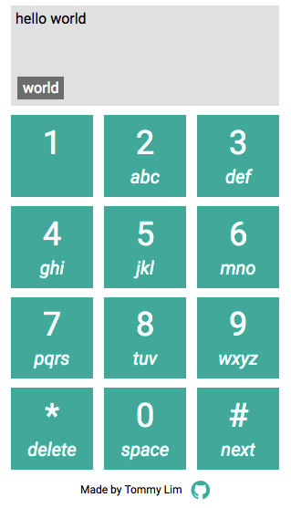

T9 built in Node, Express, and Angular demonstrates the use of a Hashmap data structure.

On the back end, a English dictionary compromised of of 187,632 words that has been converted from a .txt file to a javascript array is sent to the front end.  A dictionary object is then created using the T9 hashing function transforming words into integer keys.

Users will type in "43556" for "hello" and other words associated with that hash.

